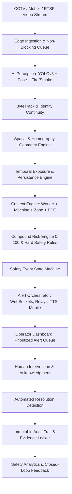

# ONE EYE — Master Production Architecture & Engineering Blueprint

> **Core Operational Loop**:  
> **CCTV Watches → AI Sees → Tracking Remembers → Context Explains → Geometry Measures → Time Verifies → Risk Engine Decides → ONE EYE Prioritizes → Human Acts → System Verifies → Evidence Is Stored → Organization Learns.**

---

## 1. Executive Summary & Design Philosophy
ONE EYE is engineered as a **real-time industrial safety decision system**, converting passive CCTV and mobile video streams into an active safety intelligence layer.

---

## 2. Component Implementation Status & Alignment

| Plan Section | Module / Component | Current Implementation Status | Production Alignment |
|---|---|---|---|
| **§3–§5 Ingestion & Edge Processing** | `app/cv/pipeline.py` `app/cv/source.py` `app/cv/usb_mobile.py` | ✅ Non-blocking frame queue running at **30–60 FPS**, decoupled from AI inference. Supports RTSP, MP4, USB Webcam, and WebSocket video streams. | Zero-stutter continuous video ingestion with explicit `OFFLINE` and `DEGRADED` health reporting. |
| **§6–§8 Perception & Tracking** | `app/cv/detector.py` `app/cv/tracker.py` `app/cv/pose.py` | ✅ YOLOv8 Object + PPE Detection, ByteTrack multi-object tracking with Kalman prediction, Fall & Fire detectors. | Multi-frame temporal consensus prevents single-frame noise/false positives. |
| **§9–§11 Spatial & Machine Proximity** | `app/cv/zones.py` `app/cv/proximity.py` `app/cv/calibration.py` | ✅ Polygon zone containment anchored at **foot-contact point (lower-center)**. 3×3 Homography floor-plane distance calibration. | Real-world distance (e.g. `1.1m from Press-01`) instead of raw pixel measurements. |
| **§12–§16 Temporal & Context Engine** | `app/events/event_manager.py` `app/cv/pipeline.py` | ✅ Exposure timers tracking continuous worker presence in danger perimeters with compound hazard synergy. | Explains **what happened, where, who, distance, and duration** (`8.4s exposure`). |
| **§17–§19 Risk Engine & State Machine** | `app/events/event_manager.py` `app/db/models.py` | ✅ Compound 0–100 Risk Score + Hard Safety Rules (`Fire`, `Immobility Fall`, `Active Machine Breach`). Full lifecycle: `MONITORING → DETECTED → EVALUATING → ALERTING → ACKNOWLEDGED → RESOLVED → LOGGED`. | Collision-free event IDs (`EVT-YYYYMMDD-HHMMSS-XXXX`) and append-only state tracking. |
| **§20–§23 Alerting & Operator UX** | `components/dashboard/` `TopNavBar.tsx` `MonitoringArray.tsx` `AlertQueue.tsx` | ✅ Prioritized alert queue (Critical top), instant camera focus, 1-click Acknowledge / Escalate, master AI & Stream pause switches. | Operator grasps critical situation in <3 seconds without interpreting raw AI complexity. |
| **§24–§26 Evidence Locker & Audit Trail** | `app/cv/evidence.py` `app/db/database.py` | ✅ Automated JPEG snapshot capture with bounding overlays and metadata stored in database. | Complete timeline from initial detection to human resolution. |
| **§27–§30 Analytics & Closed-Loop** | `components/dashboard/AnalyticsTab.tsx` `SafetyMapTab.tsx` | ✅ Recurring hazard analytics, risk distributions, zone breach charts, false-positive operator feedback. | Actionable management intelligence for process and safety procedure audits. |

---

## 3. The 6-Step Safety Operator Scenario (Reference Workflow)
1. **Normal State**: Dashboard displays green status across monitored plant sectors.
2. **Hazard Occurs**: Worker #07 enters Press-01 restricted zone while machine is active (`Distance: 1.1m`, `Duration: 8.4s`).
3. **Automated Escalation**: Risk engine scores event as `CRITICAL (86/100)`, triggers hard safety rule, dispatches WebSocket alert and warning strobe/siren relay.
4. **Operator Response**: Screen automatically surfaces CAM_03 with highlighted worker and machine. Operator clicks **ACKNOWLEDGE** (time stamped).
5. **Intervention**: Operator initiates floor intervention; Worker #07 steps back into safe corridor.
6. **Auto-Resolution & Audit**: Temporal engine verifies hazard has cleared; state transitions to **RESOLVED**, archiving snapshots, telemetry, and response times to the audit trail.
