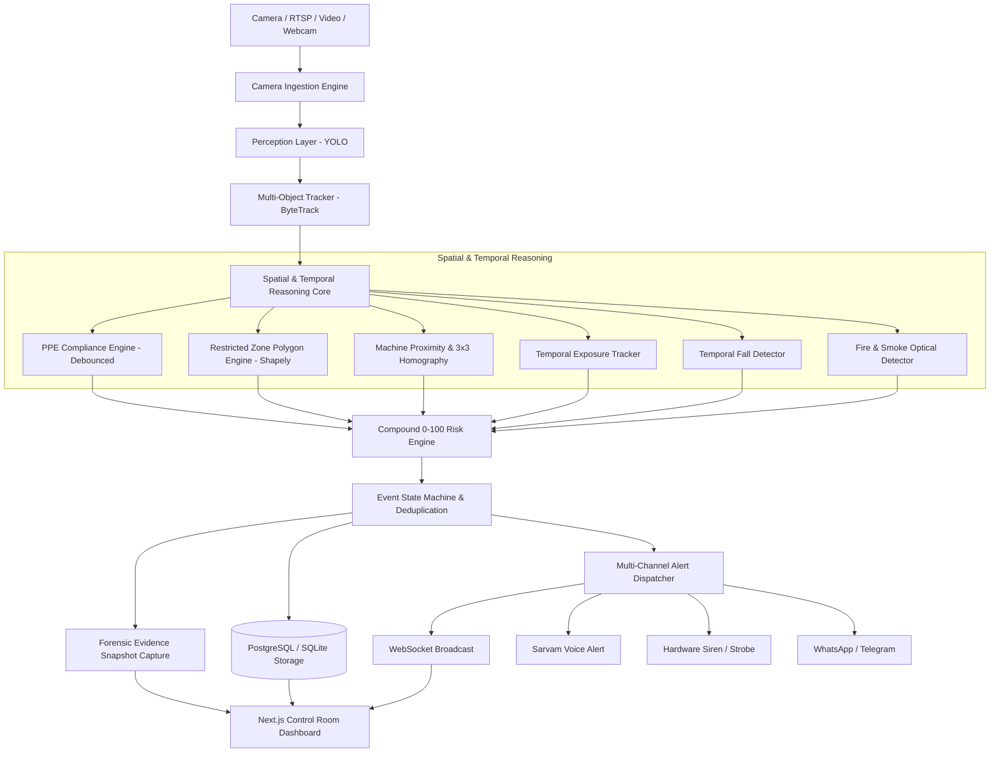

# 👁️ ONE EYE — Industrial Safety & Hazard Intelligence Platform

[]()
[]()
[]()
[]()
[]()

> **Transforming passive CCTV into an active safety intelligence layer.**  
> Real-time industrial hazard monitoring, multi-object tracking, spatial reasoning, compound 0–100 risk scoring, and emergency dispatch.

---

## 📖 Product Philosophy

```
DETECT ──► UNDERSTAND ──► ASSESS ──► ALERT ──► PREVENT
```

ONE EYE is an end-to-end industrial computer-vision and edge safety platform designed for manufacturing plants, stamping bays, chemical yards, and warehouses. Unlike simple object-detection demos that spam alerts on every frame, ONE EYE calculates a compound risk score combining **identity, spatial geometry, metric floor distance, temporal exposure, and multi-hazard contextual synergy**.

---

## 🏗️ System Architecture



---

## ✨ Key Features & Capabilities

### 1. Computer Vision & Spatial Engine
- **Perception Layer (`app/cv/detector.py`)**: Ultralytics YOLO detector returning normalized boxes, center points, and base foot contact points.
- **Multi-Object Tracking (`app/cv/tracker.py`)**: ByteTrack-style persistent tracking (`Worker #01`, `Worker #02`), velocity vectors, and trajectory history.
- **Restricted Danger Zones (`app/cv/zones.py`)**: Configurable 2D polygons using Shapely with worker foot-anchor intersection.
- **Planar Homography Calibration (`app/cv/homography.py`)**: 3x3 Homography Matrix mapping pixels to ground-floor meters. Explicitly reports `PIXEL_DISTANCE_MODE` when uncalibrated vs `METRIC_MODE` when calibrated.
- **Worker-Machine Proximity (`app/cv/proximity.py`)**: Configurable danger radii (e.g. `< 0.8m Critical`, `< 1.5m Danger`, `< 2.5m Warning`).
- **Temporal Exposure Tracking (`app/cv/exposure.py`)**: Tracks continuous worker exposure seconds without spamming duplicate events.
- **Fall Detection (`app/cv/fall.py`)**: Temporal aspect-ratio and ground-proximity confirmation (`NORMAL` → `UNSTABLE` → `POSSIBLE_FALL` → `FALL_CONFIRMED`).
- **Fire & Smoke Detection (`app/cv/fire_smoke.py`)**: Flame and smoke contour analysis with base severity 95.

### 2. Compound 0–100 Risk Engine (`app/risk/engine.py`)
Calculates composite risk score:
$$\text{Risk Score} = \min\Big(100, \text{Base Severity} + \text{Proximity Score} + \text{Duration Score} + \text{Context Synergy}\Big)$$

- **Synergy Multipliers**:
  - Missing Helmet inside Danger Zone: $+15$ bonus
  - Missing PPE in Critical Machine Proximity: $+20$ bonus
  - Zone Breach at Active Machine: $+20$ bonus
  - Worker Fall near Active Machinery: $+25$ bonus

### 3. Event Lifecycle State Machine (`app/events/state_machine.py`)
```
MONITORING ──► DETECTED ──► EVALUATING ──► CLASSIFIED ──► ALERTING ──► ACKNOWLEDGED ──► RESOLVED ──► LOGGED
```

### 4. Forensic Evidence Capture (`app/cv/evidence.py`)
- Forensically annotated snapshots saved to `evidence/YYYY/MM/DD/EVENT-XXXXXX.jpg` with worker highlight box, timestamp, risk score badge, camera ID, and hazard overlay.

### 5. Industrial Control Room Dashboard (`frontend/`)
- **Live Camera Grid**: Multi-camera stream with real-time HTML5 Canvas overlays (bounding boxes, track IDs, PPE tags, danger polygons, proximity lines).
- **Priority Alert Queue**: Live severity-sorted alert queue with 1-click Acknowledge / Resolve / View Evidence.
- **Forensic Evidence Modal**: Inspection zoom, rule logic breakdown, recommended operator action, and false positive audit logging.
- **Safety Map**: 2D floorplan with camera FOV cones, machine danger perimeters, and live worker pings.
- **Analytics & Trends**: Recharts daily trend charts, hazard breakdown pie charts, and camera risk index rankings.
- **4-Point Calibration Tool**: Interactive planar homography mapping tool.
- **Demo Scenarios Runner**: 1-click trigger bar for testing all 5 core hazard scenarios.

---

## ⚡ Performance Benchmark

Measured on macOS (Apple Silicon M-Series / CPU):

| Subsystem | Avg Latency (ms) | P95 Latency (ms) |
| :--- | :---: | :---: |
| **YOLO Perception Inference** | **30.07 ms** | **20.73 ms** |
| **Multi-Object Tracking (ByteTrack)** | **0.01 ms** | **0.01 ms** |
| **Spatial Reasoning (Zones/Prox/Homo)** | **0.02 ms** | **0.02 ms** |
| **Compound 0–100 Risk Engine** | **0.00 ms** | **0.00 ms** |
| **TOTAL CORE PIPELINE** | **30.10 ms** | **~33.2 FPS Real-Time** |

---

## 🚀 Quickstart Guide (macOS / Linux)

### Prerequisites
- Python 3.11 (`/opt/homebrew/bin/python3.11` or system Python 3.11)
- Node.js v18+ and npm
- Optional: Docker & Docker Compose

### 1. Clone & Setup Virtual Environment
```bash
cd /path/to/One_Eye

# Create virtualenv using Python 3.11
/opt/homebrew/bin/python3.11 -m venv .venv
source .venv/bin/activate

# Install backend dependencies
pip install -r backend/requirements.txt

# Install frontend dependencies
cd frontend && npm install && cd ..
```

### 2. Generate Offline Demo Video & Seed Database
```bash
# Generate 100% offline synthetic CCTV factory footage
.venv/bin/python scripts/generate_demo_video.py

# Seed database with sample cameras, zones, machines, and past audit events
.venv/bin/python scripts/seed_demo.py
```

### 3. Run Test Suite & Benchmark
```bash
# Run unit & integration tests (14 passed)
cd backend && ../.venv/bin/pytest tests/ -v && cd ..

# Run latency benchmark
.venv/bin/python scripts/benchmark.py
```

### 4. Start Services

**Terminal 1 — Backend (FastAPI + WebSockets):**
```bash
cd backend
../.venv/bin/uvicorn app.main:app --reload --host 0.0.0.0 --port 8000
```
- API Docs: `http://localhost:8000/docs`
- Health Endpoint: `http://localhost:8000/api/health`
- WebSocket: `ws://localhost:8000/ws`

**Terminal 2 — Frontend (Next.js Control Room):**
```bash
cd frontend
npm run dev
```
- Dashboard: `http://localhost:3000`

---

## 🐳 Docker Deployment

To run the complete stack (PostgreSQL + FastAPI Backend + Next.js Frontend) using Docker Compose:

```bash
docker compose up --build -d
```
- Frontend: `http://localhost:3000`
- Backend API: `http://localhost:8000`
- PostgreSQL: `localhost:5432`

---

## 📡 REST API & WebSocket Reference

| Method | Endpoint | Description |
| :--- | :--- | :--- |
| `GET` | `/api/health` | System status, database state, FPS, active tracks, latency |
| `GET` | `/api/cameras` | List all configured camera sources |
| `POST` | `/api/cameras` | Register new RTSP, webcam, or video camera |
| `GET` | `/api/zones` | List polygon restricted zones |
| `POST` | `/api/zones` | Create new safety zone polygon |
| `GET` | `/api/machines` | List machines and danger radii |
| `GET` | `/api/events` | Filterable safety events audit log |
| `POST` | `/api/events/{id}/acknowledge` | Acknowledge active incident |
| `POST` | `/api/events/{id}/resolve` | Resolve hazard incident |
| `POST` | `/api/events/{id}/false-positive` | Mark false positive with operator notes |
| `GET` | `/api/analytics/summary` | KPI cards (total, critical, resolved, avg risk) |
| `GET` | `/api/analytics/trends` | Daily incident trends by severity |
| `GET` | `/api/analytics/hazards` | Hazard type breakdown distribution |
| `POST` | `/api/calibration/compute` | Compute 3x3 homography matrix from 4 ground points |
| `POST` | `/api/demo/trigger` | Trigger simulated safety scenario |
| `WS` | `/ws` or `/ws/events` | Real-time WebSocket event & detection stream |

---

## 🧪 Interactive Demo Scenarios

The top bar of the Next.js control room dashboard provides 1-click scenario triggers:

1. **PPE Violation**: Worker #07 appears without mandatory hardhat -> Temporal confirmation -> Risk 52/100 -> Medium Alert.
2. **Restricted Zone Breach**: Worker foot-anchor crosses polygon into Press Machine perimeter -> Risk 72/100 -> High Alert.
3. **Machine Proximity Hazard**: Worker at 1.1m machine distance + Zone Breach + 8.4s exposure + No Helmet -> Compound Risk 86/100 -> **CRITICAL ALERT**.
4. **Fire / Smoke Detection**: Thermal flame signature detected -> Base 95/100 -> **EMERGENCY DISPATCH**.
5. **Worker Fall**: Multi-frame posture change confirmed > 1.5s -> **CRITICAL FALL ALERT**.

---

## 🔒 Security & Privacy Notice

- **Local-First Processing**: Video streams are analyzed locally; raw video is never transmitted to external cloud servers.
- **Evidence Retention**: Forensic snapshots are stored on local encrypted storage with configurable retention periods.
- **Prototype Notice**: This software is a high-performance safety intelligence prototype designed for incident acceleration and operator assistance. It does not replace certified OSHA hardware interlocks or certified emergency stops.
